https://github.com/bingo-todd/Gammatone-filters

Same doc with math equations properly displayed can be found in [github page](https://bingo-todd.github.io/work/2019/09/27/gtf_baseband_implementation.html)

# Gammatone-filters
A Python implementation of Gammatone filter. The filtering part is written in C for efficiency.

## Basic idea [^Holdsworth1988]
Gammatone filter is a band-pass filter, but if we shift the frequency axis right by fc (center frequency of passband), the filter can be regarded as a lowpass filter. 
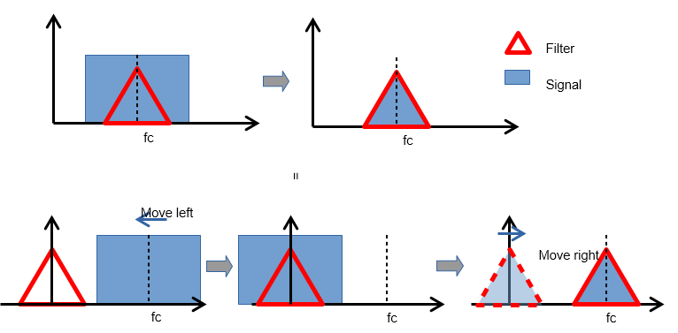
Equivalently, we can

1. Lower the frequency of input signal by fc;
2. Filter the shifted signal with the corresponding low-pass filter
3. Raise the frequency of the filtered signal by fc.


## Comparison with other implementations

Detly also published a [python implementation](https://github.com/detly/gammatone) of Gammatone filterbank
Under the same settings(fs=16 kHz, cfs=[100, 393, 948, 2000] Hz), outputs of Detly module and the current module are as follows:

<table>
<tr> <td>Detly</td> <td> 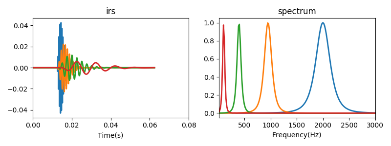 </td> </tr>
<tr>
<td> Current </td> <td> 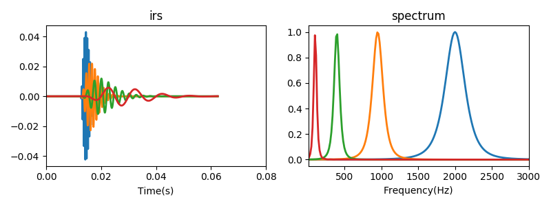 </td>
</tr>
</table>


**Difference** 

In Delty's code,  given the frequency range and band number $n$, $n+1$ points are sampled equally in $ERB scale$, and the first $n$ points are used as center frequencies of $n$ bands. This can be reasonable only if $n$  is appropriate, for example,

<table>
    <tr>
        <td> n=4 </td>
        <td> n=8 </td>
        <td> n=16 </td>
        <td> n=32 </td> 
    </tr>
    <tr>
        <td>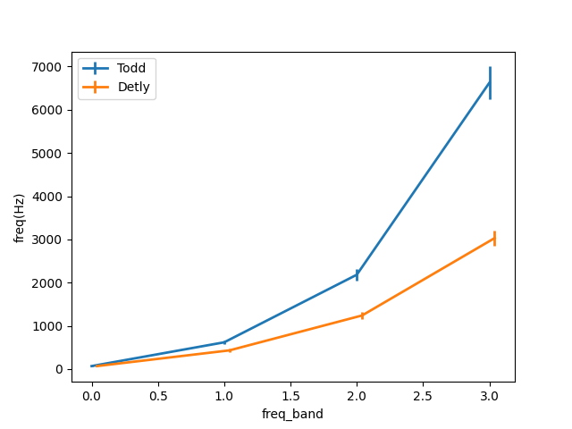</td>
        <td>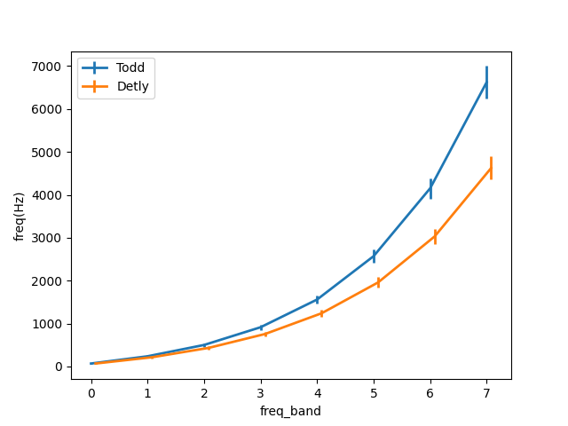</td>
        <td>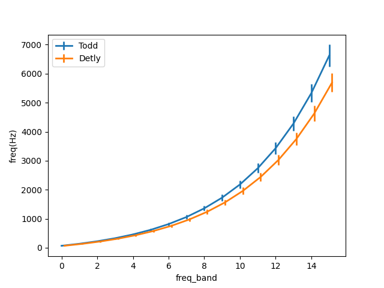</td>
        <td>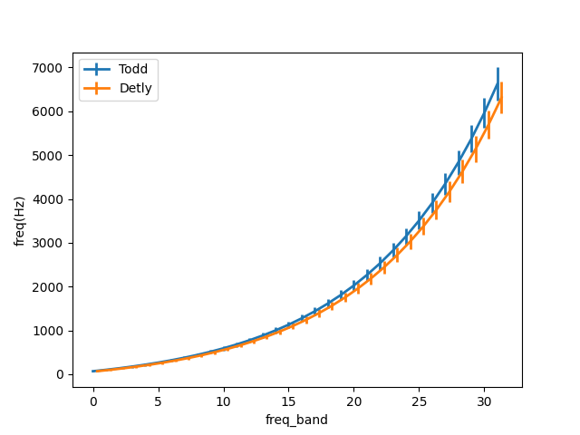</td>
    </tr>
</table>

In this module, there are two ways to ways to specified the frequency range:

1. freq_low, freq_high: the frequency range of ERB

2. cf_low, cf_hight: the frequency range of center frequencies

   eg, frequency range [70, 7000], n=4

   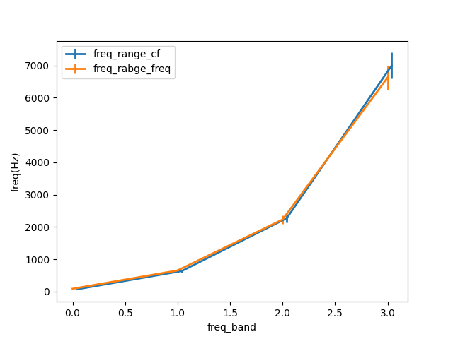

## Spectrum of filter

Taking filter with $f_c=4kHz$ as example, the amplitude spectrum $$gain(f)$$ and phase spectrum $$\phi(f)$$ is plotted as follow

  <table align="center">
  <tr>
  <td align=center> amp & phase </td>
  <td align=center> amp & delay </td> </tr>
  <tr>
  <td> 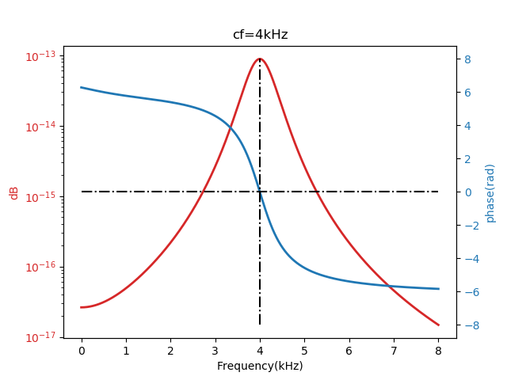 </td>
  <td> 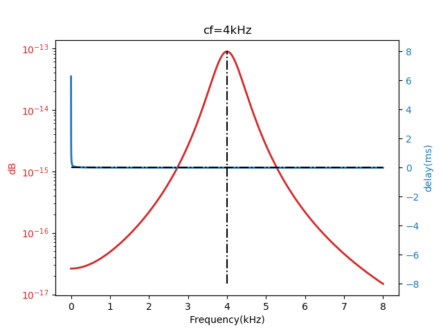 </td>
  </tr>
  </table>

  As shown in figure,

  - $ \phi(f_c)\approx 0 $;
  - Amplitude of $$\phi(f)$$ increase as $$f$$ move away from $$f_c$$;

  Gain and delay at cf as function of cf
  <center> 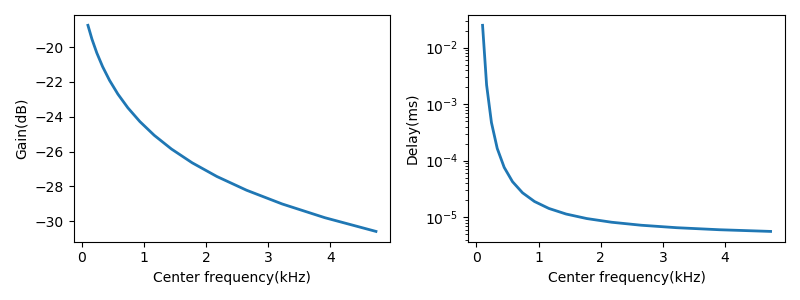 </center>
## Gain normalization

  Gammatone filter is normalized by scaling filter gain at fc to 1
  - IRs before gain normalization
  <center> 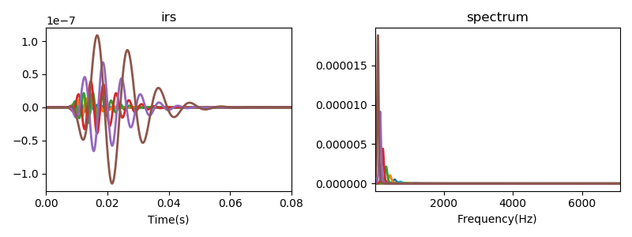 </center>
  - IRs after gain normalization
  <center> 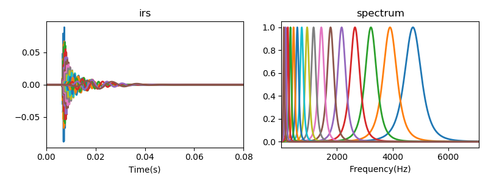 </center>
## Phase compensation

  Phase compensation is actually to align the peaks of all filter impulse response[^Brown1994].

  The impulse response of Gammatone filter is given as


$$
\begin{equation}
\begin{aligned}
g(t) = a\frac{t^{n-1}\cos(2\pi f_ct+\phi)}{e^{2\pi b t}}
\end{aligned}
\end{equation}$$
$$

  <center> 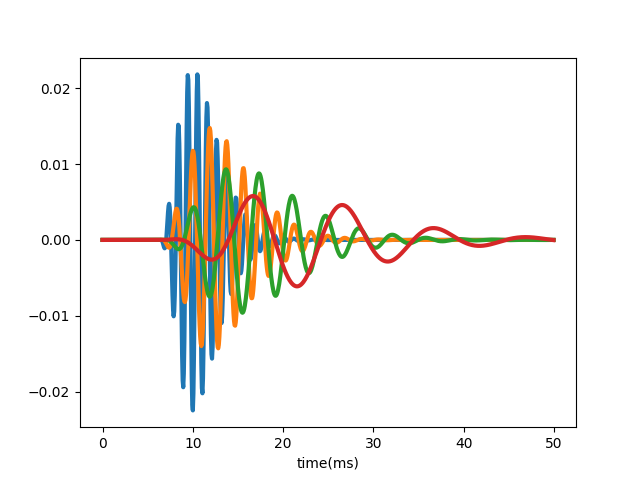 </center>
  $$g(t)$$ can be be regarded as production of two parts :

$$
\begin{equation}
  \begin{aligned}
   g(t)=g_{amp}(t)\times g_{fine}(t)
  \end{aligned}
  \end{equation}
$$

  - Envelope parts:   $$\quad g_{amp}(t) = a\frac{t^{n-1}}{e^{2\pi b t}}$$
  - Fine structure part: $$\quad g_{fine}(t) = \cos(2\pi f_ct+\phi)$$

### Envelope alignment


  The peak position $t_{peak}$ can be derived by setting the first-order derivative of $g_{amp}(t)$ to 0

$$
\begin{equation}
  \begin{aligned}
  \frac{\partial g_{amp}(t)}{\partial t} &= \frac{(n-1)t^{n-2}}{e^{2\pi bt}}-\frac{t^{n-1}2\pi b}{e^{2\pi bt}}\\
  &=\frac{t^{n-2}}{e^{2\pi bt}}(n-1-2\pi bt) \triangleq 0\\
  \Rightarrow& \quad t_{peak}=\frac{(n-1)}{2\pi b}
  \end{aligned}
  \end{equation}
$$
  Delay $g_{amp}$ by $t_{peak}-t_0$ can make its peak value occurs at $t_0$

$$
\begin{equation}
  \begin{aligned}
  g_{align}(t) = g_{amp}(t+\tau)g_{fine}(t)
  \end{aligned}
  \end{equation}
$$


  Example: $t_0=20 ms$;  $\phi=0$ 
  <center> 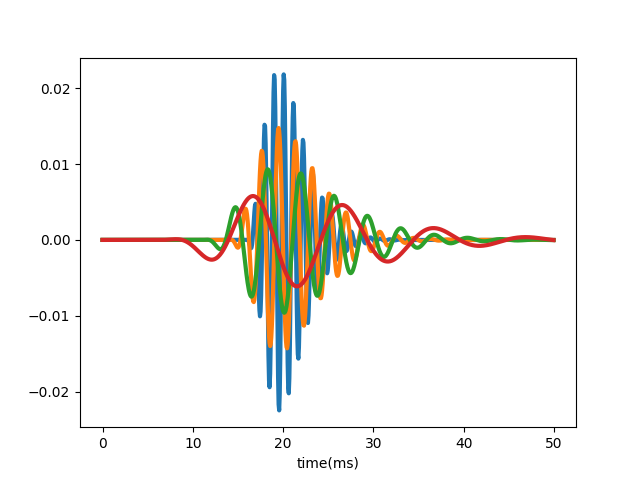 </center>
### Fine structure alignment
  Suppose $g_{amp}(t)$ achieve maximum at $t_0$, we can make  $$g_{fine}(t_0)=1$$ by adjusting $\phi$
$$
\begin{equation}
  \begin{aligned}
  & \cos(2\pi f_ct+\phi)|_{t=t_{0}} \triangleq 1\\
  \Rightarrow& \quad  \phi = -2\pi f_c t_0+i2\pi, \quad i=0,\pm 1,\cdots
  \end{aligned}
  \end{equation}
$$

  <center> 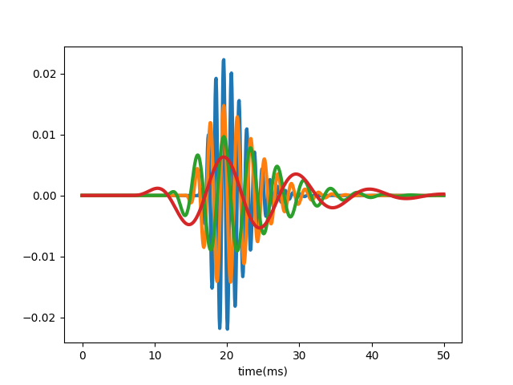</center>
### Illustration of  alignment

  For a stimulus of impulse, what if we add up all filter outpus ?  Ideally, a impulse is expected

  <table>
  <tr>
  <td align=center> Not aligned </td>
  <td align=center> Envelope aligned </td>
  <td align=center> Envelop & fine structure aligned </td>
  </tr>
  <tr>
  <td> <center> 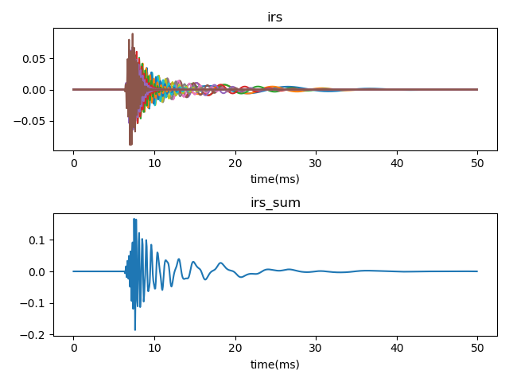 </center> </td>
  <td>   <center> 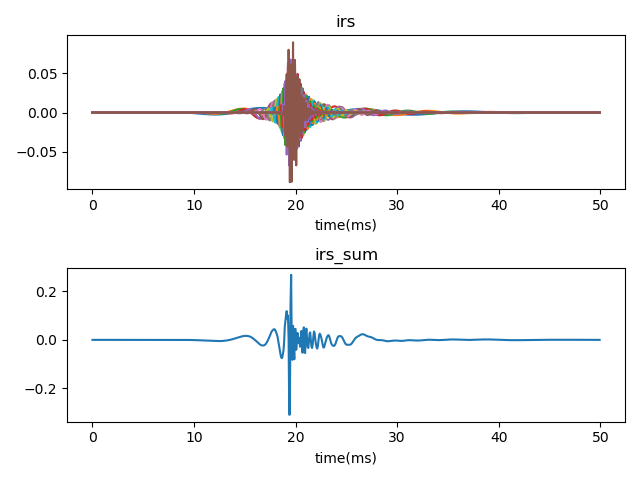 </center> </td>
  <td>   <center> </center> </td>
  </tr>
  </table>

## About efficiency

```shell
 python .\efficiency.py
 #time consumed(s) for filtering signal with length of 16e3 samples
 #     c  :0.11
 #     python  :11.81
```

## Built-in examples

Corresponding to above-mentioned tests

```
validate.py
efficiency.py
filter_spectrum.py
gain_normalization.py
phase_compensation.py
stimulus_restore.py
```


[^Holdsworth1988]: Holdsworth, John, Roy Patterson, and Ian Nimmo-Smith. Implementing a GammaTone Filter Bank

[^Brown1994]: G. J. Brown and M. P. Cooke (1994) Computational auditory scene analysis. Computer Speech and Language, 8, pp. 297-336
